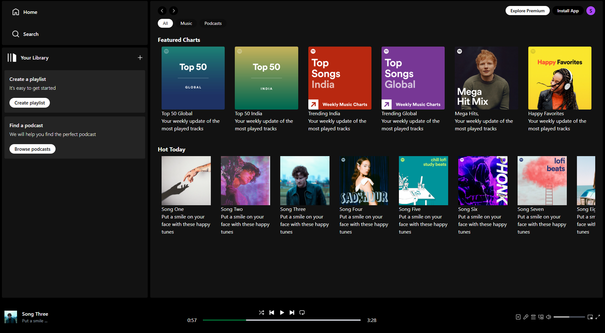
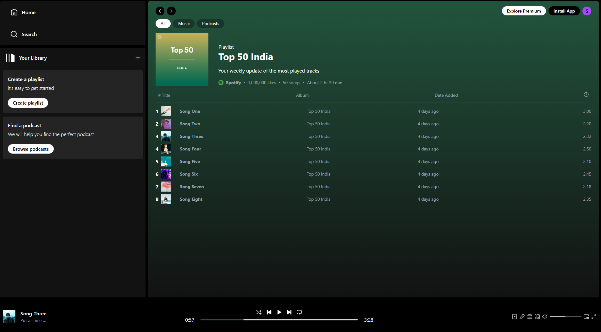

# 🎵 React Spotify Clone

A simple Spotify-inspired music player built with **React** and **Vite**, featuring a clean Spotify-like UI. This project plays a few locally stored songs and mimics the core user interactions of a music streaming app—**no backend required**.

## ✨ Features

- 🎧 Spotify-style UI
- 💽 Open albums and browse tracks
- ⏯ Play/Pause songs
- ⏩ Skip to next/previous track
- 🎚 Seek through a song
- 📀 Play full albums

## 🖼 Screenshots

### Home



### Album



## 🛠 Tech Stack

- [React](https://reactjs.org/)
- [Vite](https://vitejs.dev/)
- Tailwind CSS
- No backend – all assets are local

## 🚀 Getting Started

### 1. Clone the repository

```bash
git clone https://github.com/jas-singhh/SpotifyClone.git
cd SpotifyClone
npm install
npm run dev

```
